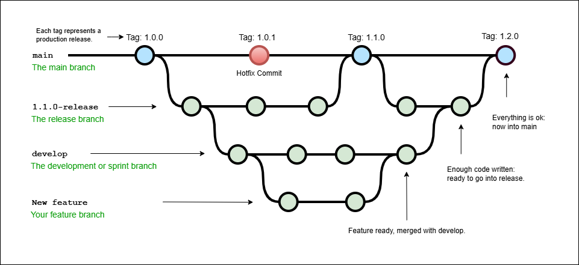

# Ingegneria del Software Avanzata A.A. 2025/2026
## Fondamenti di Git

Docente: Damiano Azzolini - Università di Ferrara

---

## Sistemi di Controllo di Versione (VCS)
Il codice sorgente viene modificato costantemente per aggiungere funzionalità, effettuare refactoring o correggere errori. I sistemi VCS permettono di gestire queste versioni per:
* **Confronto**: analizzare le differenze con versioni precedenti
* **Rollback**: recuperare e tornare a una versione precedente del codice

### Tipologie di VCS
* **Locali**: gestiti interamente sul proprio PC
* **Centralizzati**: il repository risiede su una macchina remota
* **Distribuiti**: il repository è presente su molteplici macchine, alcune delle quali fungono da server (es. Git)

---

## Cos'è Git?
Git è un sistema di controllo di versione distribuito, creato nel 2005 da Linus Torvalds.
Caratteristiche:
* **Indipendenza**: gli utenti mantengono il codice e la cronologia completa sulla propria macchina
* **Lavoro Offline**: è possibile apportare modifiche senza accesso a internet, ad eccezione delle fasi di sincronizzazione con il server

---

## Concetti Principali

| Termine | Definizione |
| --- | --- |
| **Cartella .git** | Archivio locale che tiene traccia di tutte le modifiche |
| **Working tree** | Cartella di lavoro corrente con un repository associato (presenza di cartella `.git`) |
| **Commit** | Fotografia (snapshot) del working tree in un determinato momento. Ogni commit contiene le variazioni, il riferimento al commit precedente (parent) e un hash identificativo univoco |
| **Index (Staging Area)** | File modificati pronti per essere inclusi nel prossimo commit |
| **Branch** | Linea di sviluppo specifica; quello di default è solitamente `master` o `main` |
| **HEAD** | Puntatore all'ultimo commit (estremità o *tip*) del branch corrente |

---

## Stati del File e Flusso di Lavoro
Ogni file può trovarsi in tre stati principali:
1. **Modified**: file modificato ma non ancora pronto per il commit
2. **Staged**: file inserito nella staging area per il commit successivo
3. **Committed**: file salvato nel database

Lo sviluppo segue ripetutamente queste fasi: 
1. lavoro sul working tree 
2. aggiunta all'index
3. esecuzione del commit

---

## Workflow Collaborativi

### Centralised Workflow
Un repository centrale accetta il codice e tutti gli sviluppatori sincronizzano il proprio lavoro direttamente su di esso.

### Integration-manager Workflow
Tipico dell'open source:
1. L'**Integration Manager** gestisce il *blessed repository* pubblico
2. I collaboratori clonano il repository, lavorano localmente e caricano le modifiche su un proprio repository pubblico
3. I collaboratori chiedono al manager di integrare le modifiche (pull request)
4. Il manager controlla, integra localmente e carica sul *blessed repository*

### Dictator and Lieutenant Workflow
Organizzazione gerarchica per progetti molto grandi:
* Gli sviluppatori lavorano in repository privati
* I **Lieutenant** uniscono le modifiche degli sviluppatori
* Il **Dictator** unisce i repository dei lieutenant e aggiorna il *blessed repository*

---

## Operazioni sui Repository Remoti
I repository remoti possono essere ospitati internamente o su servizi come **GitHub**, **BitBucket** o **GitLab**.

* **Clone**: copia un repository remoto sulla macchina locale
* **Pull**: scarica i commit remoti e allinea il repository locale
* **Push**: carica i commit locali per allineare il repository remoto

> **Nota sui commit**: quando si esegue un commit, il codice dovrebbe essere funzionante e testato.

## Esempio di Branch

