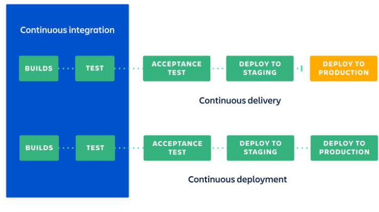

# Ingegneria del Software Avanzata A.A. 2025/2026
## CICD

Docente: Damiano Azzolini - Università di Ferrara

---

**Continuous Integration (CI)**: appena l'implementazione di una funzionalità o la correzione di un errore sono state terminate, le modifiche vengono integrate nel sistema (push nel repository remoto, possibimente non nel branch principale).
Poi, il sistema viene compilato (build del sistema) e vengono eseguiti tutti i test *in maniera automatica*.
Se i test hanno successo, il codice può essere poi integrato nel branch principale (`main`, `master` o altro nome).

---

CD può indicare Continuous Delivery o Continuous Deployment.

**Continuous Delivery (CD)**: è un'estensione della continuous integration in cui se una versione del sistema supera il building e tutti i test automatici, viene creata una versione pronta per essere distribuita.

**Continuous Deployment (CD)**: è un'estensione della continuous integration in cui se una versione del sistema supera il building e tutti i test automatici, il sistema viene distribuito ai clienti *in maniera automatica*.

---



Da: [Atlassian - Continuous Integration vs Delivery vs Deployment](https://www.atlassian.com/continuous-delivery/principles/continuous-integration-vs-delivery-vs-deployment)

*Nota: Blocco arancio = operazione manuale.*

## Numero di Versione

Come associare un numero di versione ad un software?

[Semantic Versioning](https://semver.org/)

Numero di versione con struttura: `MAJOR.MINOR.PATCH`

Come incrementare:
* `MAJOR`: cambiamento incompatibile di API
* `MINOR`: introduzione funzionalità backward compatible
* `PATCH`: fix bug backward compatible

Eventualmente è possibile aggiungere ulteriori etichette per pre-release e metadata dopo PATCH.

## GitHub Actions

Servizio di CI/CD di GitHub: [GitHub Actions Documentation](https://docs.github.com/en/actions)

Permette di eseguire *automaticamente* il build, i test e il deploy del codice.

Le operazioni da eseguire sono definite all'interno di un file di configurazione YAML: [Learn X in Y minutes - YAML](https://learnxinyminutes.com/docs/yaml/)


Lessico:

* **Workflow**: processo automatizzato che esegue uno o più job a seguito di un evento (*event*). Possono essere associati più workflow ad un repository. Definiti all'interno della cartella `.github/workflows`
* **Runner**: server che esegue un workflow (i workflow sono eseguiti all'interno di macchine virtuali o container docker).
* **Event**: attività che scatena un workflow. Esempio: pull request, open issue, push, ...
* **Job**: serie di comandi eseguiti in maniera sequenziale all'interno di un workflow.

Lo strumento [`act`](https://nektosact.com/installation/index.html) ci permentte di simulare le actions in locale.


## Bitbucket Pipeline

Servizio CI/CD integrato in Bitbucket: [Bitbucket Pipelines Get Started](https://support.atlassian.com/bitbucket-cloud/docs/get-started-with-bitbucket-pipelines/)

Con le bitbucket pipeline vengono creati dei container Docker nel cloud e all'interno di questi container vengono eseguiti dei comandi per il build, il test e il deploy automatico.

File di configurazione YAML chiamato `bitbucket-pipelines.yml` che deve essere nella cartella root del progetto. Diversi strumenti permettono di partire da template già esistenti.

## Esempio GitHub Action per Applicazione
```yml
name: Python application

on:
  push:
    branches: [ "master" ]
  pull_request:
    branches: [ "master" ]

permissions:
  contents: read

jobs:
    build:  
        runs-on: ubuntu-latest

        steps:
            - uses: actions/checkout@v4
            
            - name: Set up Python 3.10
                uses: actions/setup-python@v3
                with:
                    python-version: "3.10"
            
            - name: Install dependencies
                run: |
                    python -m pip install --upgrade pip
                    pip install flake8 pytest
                    if [ -f requirements.txt ]; then pip install -r requirements.txt; fi
            
            - name: Lint with flake8
                run: |
                    # stop the build if there are Python syntax errors or undefined names
                    flake8 . --count --select=E9,F63,F7,F82 --show-source --statistics
                    # exit-zero treats all errors as warnings. The GitHub editor is 127 chars wide
                    flake8 . --count --exit-zero --max-complexity=10 --max-line-length=127 --statistics
            
            - name: Test with pytest
                run: |
                    pytest
            
            - name: Login to Docker Hub
                uses: docker/login-action@v4
                with:
                    username: ${{ secrets.DOCKERHUB_USERNAME }}
                    password: ${{ secrets.DOCKERHUB_TOKEN }}

            - name: Build and push
                uses: docker/build-push-action@v7
                with:
                    context: .
                    file: ./Dockerfile
                    push: true
                    tags: ${{ secrets.DOCKERHUB_USERNAME }}/app:latest


```